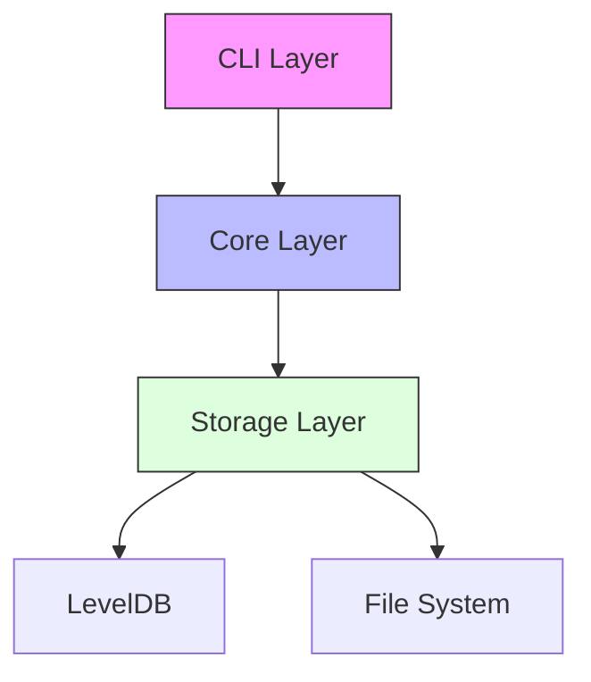
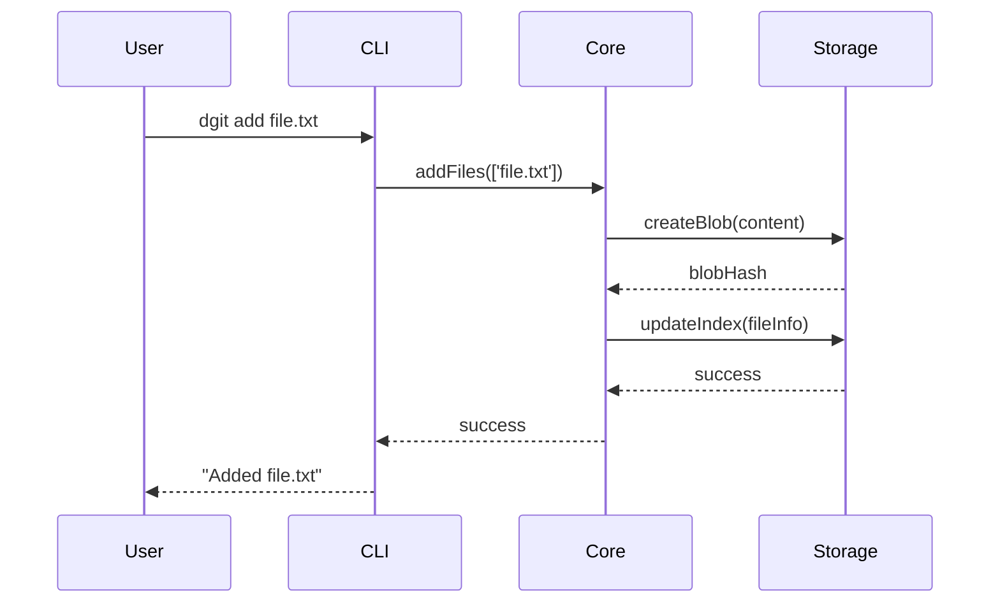
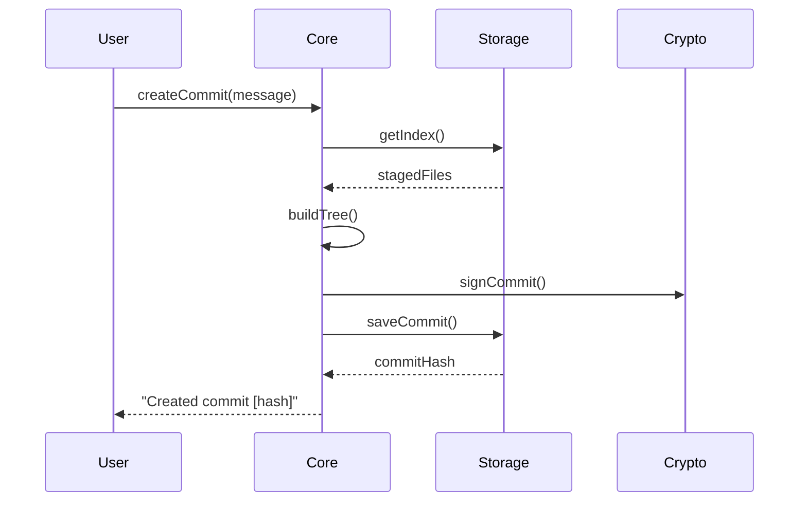

## System Overview

dGit is built with a layered architecture that separates concerns and promotes modularity.



## Core Components

### 1. CLI Layer

- **Purpose**: Handles user interaction and command parsing
- **Location**: `src/cli/`
- **Key Components**:
  - Command parser
  - User input validation
  - Output formatting

### 2. Core Layer

- **Purpose**: Implements core version control logic
- **Location**: `src/core/`
- **Key Components**:
  - Repository initialization (`init.js`)
  - File staging (`add.js`)
  - Commit creation (`commit.js`)
  - Object model implementation

### 3. Storage Layer

- **Purpose**: Manages data persistence
- **Location**: `src/storage/`
- **Key Components**:
  - LevelDB integration
  - Object storage
  - Index management

## Data Model

### Objects

dGit uses three types of objects:

1. **Blobs**

   - Store file contents
   - Content-addressable by SHA-1 hash

   ```javascript
   {
     type: 'blob',
     content: Buffer
   }
   ```

2. **Trees**

   - Represent directories
   - Contains references to blobs and other trees

   ```javascript
   {
     type: 'tree',
     entries: {
       'filename': { type: 'blob', hash: 'sha1' },
       'dirname': { type: 'tree', hash: 'sha1' }
     }
   }
   ```

3. **Commits**
   - Represent snapshots
   - Include metadata and cryptographic signatures
   ```javascript
   {
     type: 'commit',
     tree: 'sha1',
     parent: 'sha1',
     author: 'string',
     message: 'string',
     timestamp: 'ISO string',
     signature: 'string'
   }
   ```

## Data Flow

### Adding Files



### Creating Commits



## Security

### Cryptographic Verification

- RSA key pair generation on init
- Commit signing with private key
- Verification with public key
- SHA-1 hashing for content addressing

## Performance Considerations

### Storage Optimization

- Content-addressable storage prevents duplication
- LevelDB for efficient key-value operations
- Lazy loading of objects
- Batch operations for better performance

## Next Steps

- Learn about the [Storage Implementation](./storage)
- View the [API Reference](../api-reference)
- Check [Example Workflows](../workflows)
