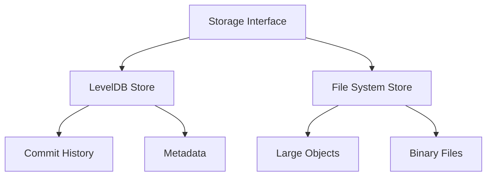

## Overview

dGit uses a hybrid storage approach combining LevelDB for efficient key-value operations and the file system for large objects.

## Storage Layer Architecture



## LevelDB Schema

### Key Prefixes and Structure

| Prefix    | Purpose           | Example Key     | Value Type  |
| --------- | ----------------- | --------------- | ----------- |
| `commit:` | Commit objects    | `commit:abc123` | JSON        |
| `object:` | Trees and blobs   | `object:def456` | Buffer/JSON |
| `branch:` | Branch references | `branch:main`   | String      |
| `index`   | Staging area      | `index`         | JSON        |

### Data Structures

#### 1. Commit Objects

```javascript
{
  tree: "hash",          // Root tree hash
  parent: "hash",        // Parent commit hash
  author: "string",      // Author information
  timestamp: "string",   // ISO 8601 date
  message: "string",     // Commit message
  signature: "string"    // Cryptographic signature
}
```

#### 2. Tree Objects

```javascript
{
  entries: {
    "filename": {
      type: "blob|tree",
      hash: "string",
      mode: "100644|040000"
    }
  }
}
```

#### 3. Index (Staging Area)

```javascript
{
  files: {
    "path/to/file": {
      hash: "string",
      size: number,
      timestamp: number,
      type: "blob",
      mode: "100644"
    }
  }
}
```

## API Methods

### Core Storage Operations

```javascript
class Storage {
  // Initialization
  async init(): Promise<void>
  async close(): Promise<void>

  // Commit Operations
  async saveCommit(hash: string, data: CommitData): Promise<void>
  async getCommit(hash: string): Promise<CommitData | null>
  async getCommitHistory(): Promise<string[]>

  // Object Operations
  async saveObject(hash: string, content: any): Promise<void>
  async getObject(hash: string): Promise<any | null>

  // Index Operations
  async saveIndex(data: IndexData): Promise<void>
  async getIndex(): Promise<IndexData>
}
```

## Implementation Details

### 1. Database Initialization

```javascript
constructor(repoPath = '.dgit') {
  this.dbPath = path.join(repoPath, 'db');
  this.db = new Level(this.dbPath, {
    valueEncoding: 'json'
  });
}

async init() {
  await this.db.open();
  await this.db.put('metadata', {
    version: '1.0',
    created_at: new Date().toISOString()
  });
}
```

### 2. Object Storage Strategy

```javascript
async saveObject(hash: string, content: any) {
  const key = `object:${hash}`;
  if (content.length > LARGE_OBJECT_THRESHOLD) {
    // Store large objects in filesystem
    await this.saveToFS(hash, content);
    await this.db.put(key, { type: 'external' });
  } else {
    // Store small objects in LevelDB
    await this.db.put(key, content);
  }
}
```

### 3. Commit History Management

```javascript
async saveCommit(hash: string, data: CommitData) {
  await this.db.batch([
    { type: 'put', key: `commit:${hash}`, value: data },
    { type: 'put', key: 'head', value: hash }
  ]);
}
```

## Performance Optimizations

### 1. Batch Operations

- Group related operations
- Atomic transactions
- Reduced I/O overhead

### 2. Caching Strategy

```javascript
class StorageCache {
  private cache: Map<string, any>;
  private maxSize: number;

  async get(key: string): Promise<any> {
    if (this.cache.has(key)) {
      return this.cache.get(key);
    }
    const value = await this.db.get(key);
    this.cache.set(key, value);
    return value;
  }
}
```

### 3. Large Object Handling

- Threshold-based storage selection
- Streaming for large files
- Compression for text content

## Error Handling

```javascript
async getObject(hash: string) {
  try {
    const value = await this.db.get(`object:${hash}`);
    return value.type === 'external'
      ? await this.getFromFS(hash)
      : value;
  } catch (error) {
    if (error.code === 'LEVEL_NOT_FOUND') {
      return null;
    }
    throw new Error(`Storage error: ${error.message}`);
  }
}
```

## Next Steps

- Review [API Reference](../api-reference)
- See [Example Workflows](../workflows)
- Check [Troubleshooting](../troubleshooting)
