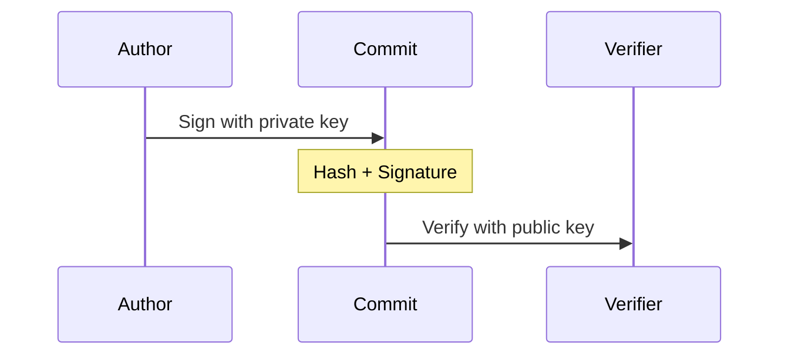

## Overview

Secure commit verification using GPG:

1. **Key Management**

   - Key generation
   - Key distribution
   - Trust models

2. **Commit Signing**
   - Author verification
   - Tamper detection
   - Signature validation

## Implementation

## Security Features

1. **Identity Verification**

   - Author authentication
   - Non-repudiation
   - Trust chains

2. **Data Integrity**
   - Commit protection
   - History verification
   - Tamper detection
