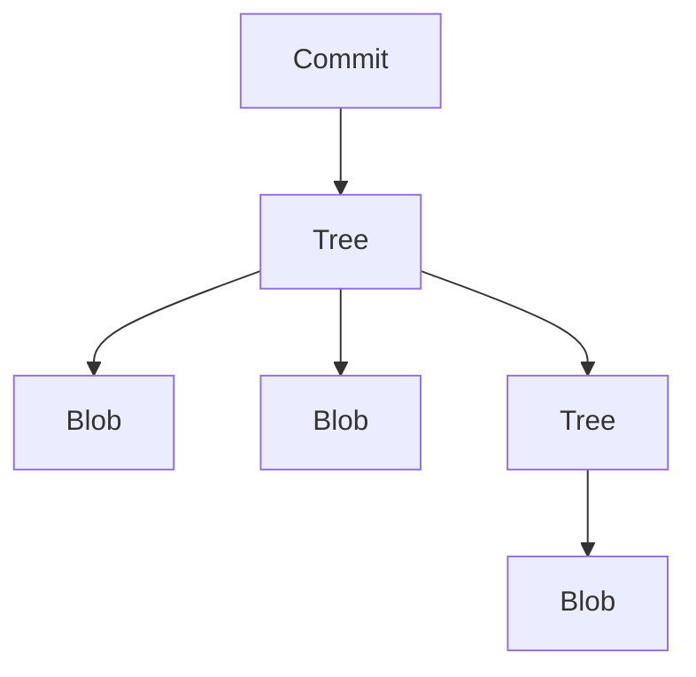

Git's object model consists of four main types:

## 1. Blobs

- Raw file content
- Content-addressable storage
- No metadata, just data

## 2. Trees

- Directory listings
- Points to blobs and other trees
- Contains file modes and names

## 3. Commits

- Snapshots of the repository
- Points to trees
- Contains metadata (author, message)

## 4. References

- Pointers to commits
- Branches, tags, and HEAD
- Lightweight navigation

## Object Storage

