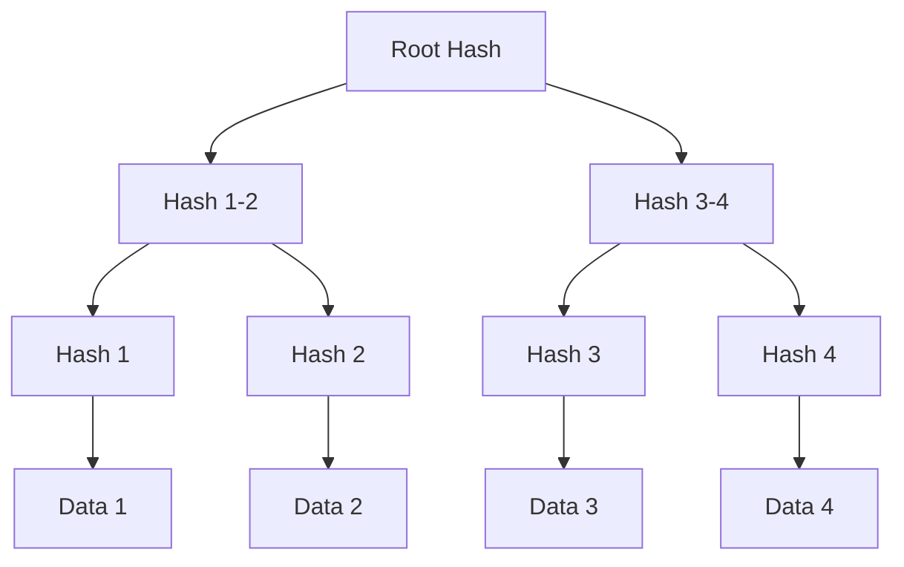

## Overview

Merkle trees are fundamental to Git's integrity:

- Hash-linked data structures
- Immutable history tracking
- Efficient verification

## Implementation

## Benefits

1. **Integrity Verification**

   - Each node verifies children
   - Changes are immediately detected

2. **Efficient Comparisons**

   - Quick difference detection
   - Partial verification possible

3. **Deduplication**
   - Content-addressable storage
   - Automatic file deduplication
